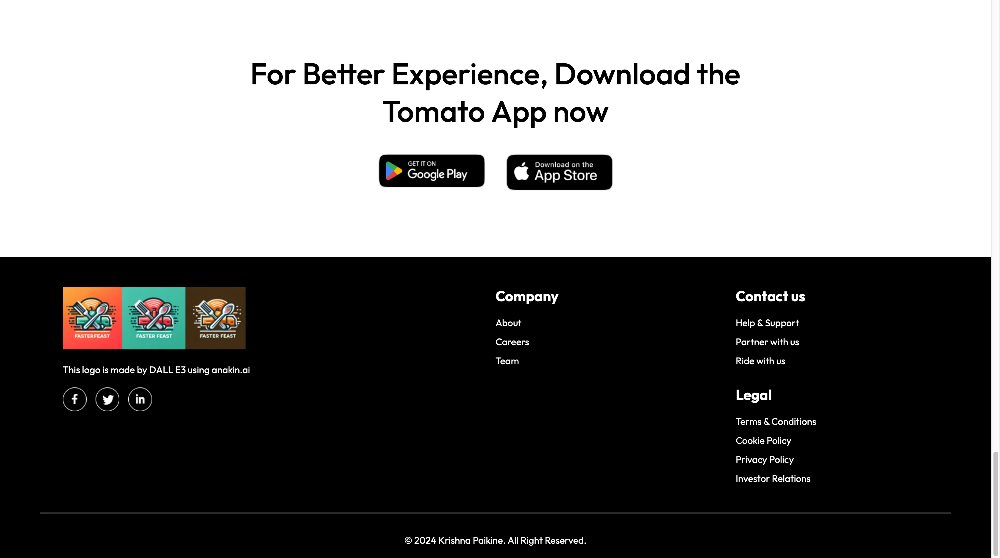
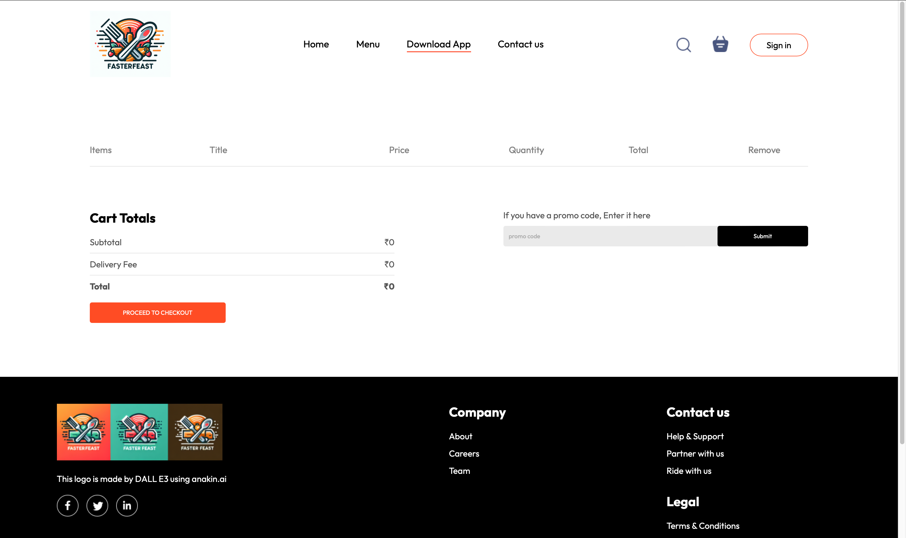
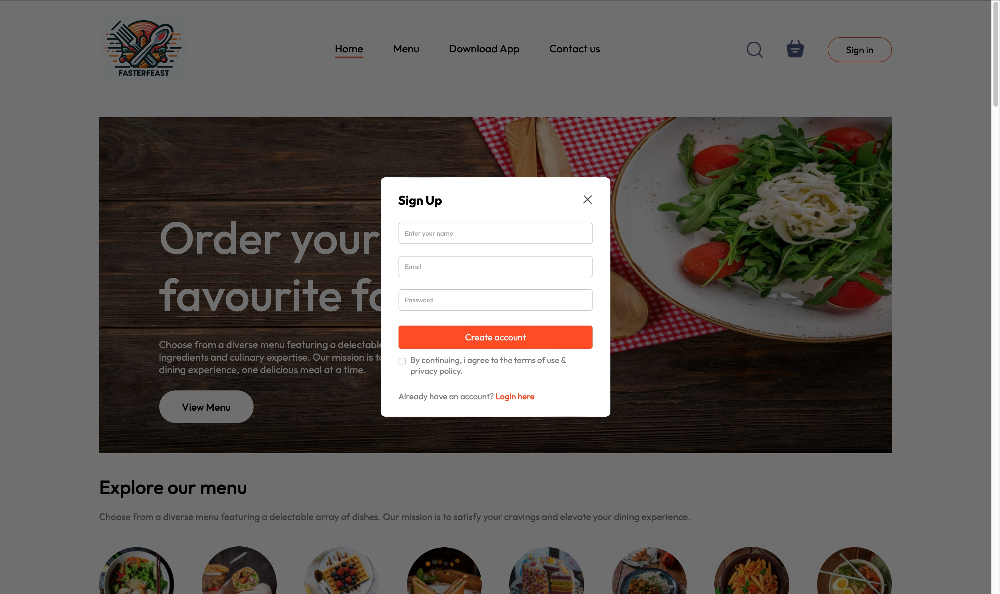
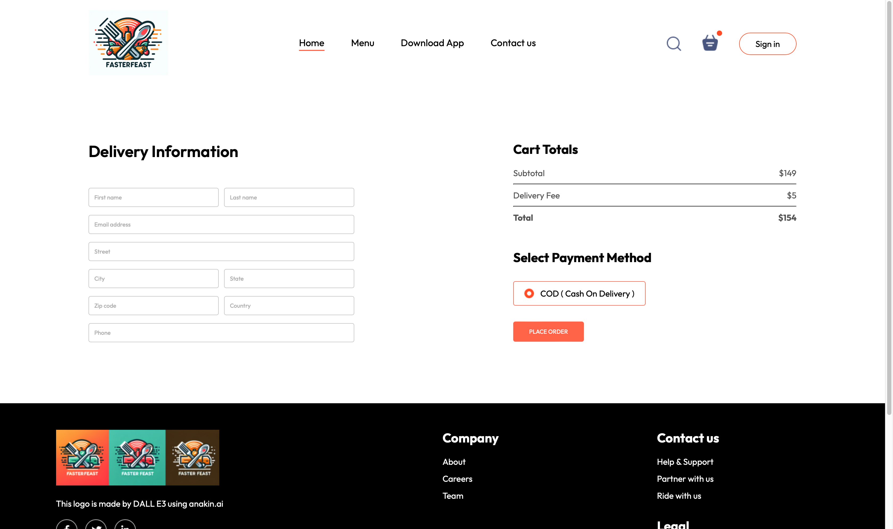

# Krishna Paikine - Food Ordering Website

Faster Feast is a food ordering website built using Vite and React. It aims to provide users with a seamless experience to browse through various cuisines, select dishes, and place orders online.

## Features

1. User Authentication: Allow users to sign up, log in, and manage their profiles.
2. Browse Cuisines: Explore a wide range of cuisines available for ordering.
3. Search Functionality: Find specific dishes or cuisines quickly using the search feature.
4. Order Placement: Select dishes, customize orders, and place them securely.
5. Payment Integration: Integrate with payment gateways for secure transactions.
6. Order Tracking: Allow users to track their orders in real-time.

## Demo Screenshots







## Technologies Used

HTML, CSS, JavaScript

Vite: A modern build tool that serves your code via native ES module imports during development.

React: A JavaScript library for building user interfaces.

Styled Components: CSS-in-JS library for styling React components.

Stripe: Payment processing platform for handling transactions securely.
Getting Started

To get a local copy up and running follow these simple steps.

## Prerequisites

Before you begin, ensure you have met the following requirements:

- [Git](https://git-scm.com/downloads "Download Git") must be installed on your operating system.

## Install node modules

```bash
npm install
```

### Run Locally

To run **Faster Feast** locally, run this command on your git bash:

Linux and macOS:

```bash
sudo git clone https://github.com/gutsdkrishna/FasterFeasts-main.git
```

Windows:

```bash
git clone https://github.com/gutsdkrishna/FasterFeasts-main.git
```

## License

Distributed under the MIT License. See **LICENSE** for more information.

## Thank You
